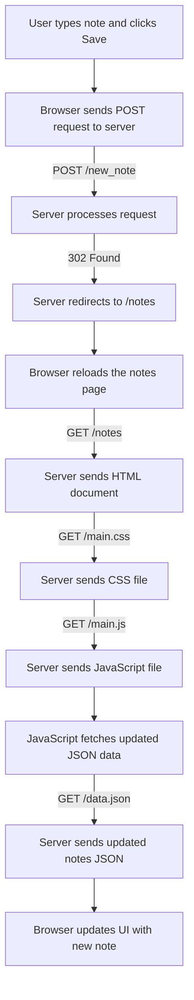

```mermaid
  flowchart TD
    A[User types note and clicks Save] --> B[Browser sends POST request to server]
    B -->|POST /new_note| C[Server processes request]
    C -->|302 Found| D[Server redirects to /notes]
    D --> E[Browser reloads the notes page]

    E -->|GET /notes| F[Server sends HTML document]
    F -->|GET /main.css| G[Server sends CSS file]
    G -->|GET /main.js| H[Server sends JavaScript file]

    H --> I[JavaScript fetches updated JSON data]
    I -->|GET /data.json| J[Server sends updated notes JSON]
    
    J --> K[Browser updates UI with new note]
```
