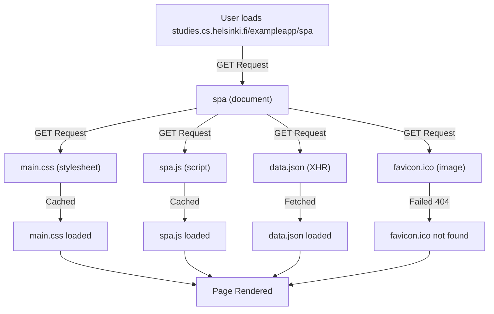

```mermaid
  graph TD;
    Start["User loads studies.cs.helsinki.fi/exampleapp/spa"] -->|GET Request| HTML["spa (document)"]
    HTML -->|GET Request| CSS["main.css (stylesheet)"]
    HTML -->|GET Request| JS["spa.js (script)"]
    HTML -->|GET Request| JSON["data.json (XHR)"]
    HTML -->|GET Request| Favicon["favicon.ico (image)"]

    CSS -->|Cached| LoadedCSS["main.css loaded"]
    JS -->|Cached| LoadedJS["spa.js loaded"]
    JSON -->|Fetched| LoadedJSON["data.json loaded"]
    Favicon -->|Failed 404| Error["favicon.ico not found"]

    LoadedCSS --> Finish["Page Rendered"]
    LoadedJS --> Finish
    LoadedJSON --> Finish
    Error --> Finish
```
