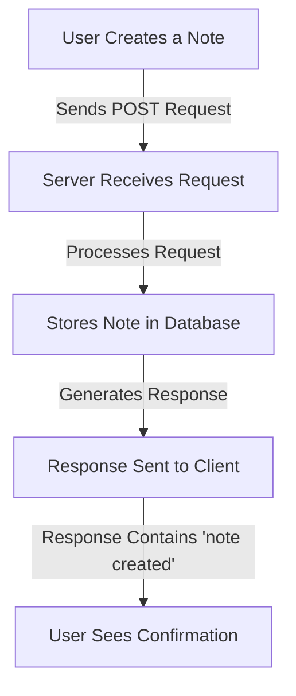

```mermaid
  graph TD
    A[User Creates a Note] -->|Sends POST Request| B[Server Receives Request]
    B -->|Processes Request| C[Stores Note in Database]
    C -->|Generates Response| D[Response Sent to Client]
    D -->|Response Contains 'note created'| E[User Sees Confirmation]

    click B "https://studies.cs.helsinki.fi/exampleapp/spa"
    click D "Response Headers and Body"
```
